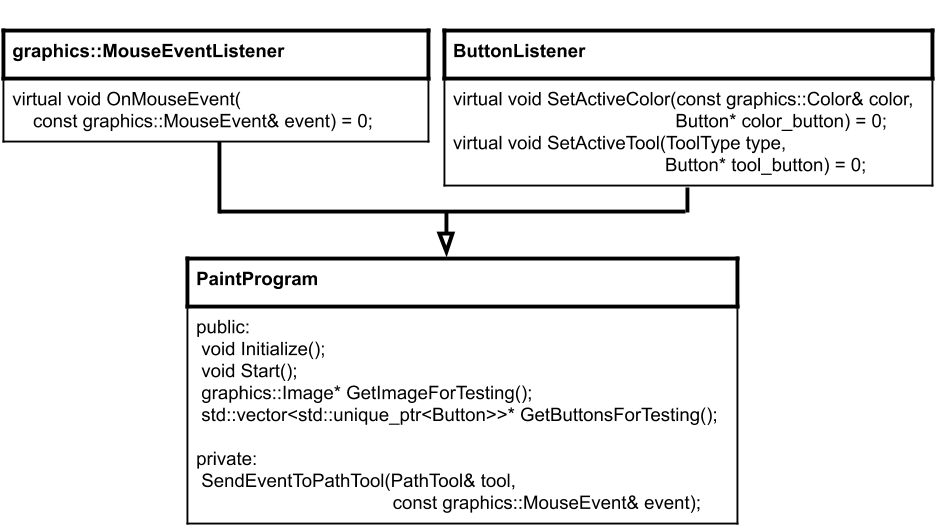
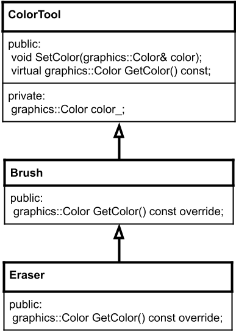

# Paint Project: Milestone Six

This is milestone six of the [TuffyPaint project](https://docs.google.com/document/d/14LLKdJq5gZXLop5UAocTiLffNS2QW0d7C7DGbzPR-gc).

We will add the buttons from Milestone Five into the PaintProgram created in Milestone Four to create a fully functional Paint application. Then we will create one more tool, an eraser, to put it all together.

Please read this carefully and then come ask for help if you get stuck.

*Please note: You will be only working on paint_program.h/.cc, eraser.h/.cc, and main.cc in this milestone. Copy all your .cc and .h from milestone 4 except tool_type.h, and the tool_button.cc/h and color_button.cc/h and button.cc/h from milestone 5. Run ``make old_tests`` to ensure you've copied the code correctly.*

## Goal

``PaintProgram`` will create a collection of ``Button`` objects and draw them on the screen. When the ``PaintProgram`` gets a ``graphics::MouseEvent`` events in ``OnMouseEvent`` it will first check if any of its ``Button`` objects want to handle that event, otherwise it will send the event to the drawing tools as in Milestone Four.

In Milestone Five we were introduced to an abstract interface, ``ButtonListener``, which enables handling of tool and color button actions. ``PaintProgram`` will inherit from ``ButtonListener`` in order to know when its buttons are clicked (see inheritance diagram below).



## ``PaintProgram`` inherits from ``ButtonListener``

Update ``PaintProgram`` to inherit from ``ButtonListener``, which is found in ``button_listener.h``. Recall from Milestone Five that ``ButtonListener`` contains two pure virtual methods:

```cpp
// This method is called when a Button wants to change the active color. The
// implementor of ButtonListener could use the |color| parameter to update
// any relevant tool's colors.
virtual void SetActiveColor(const graphics::Color& color,
                            Button* color_button) = 0;

// This method is called when a Button wants to change the active tool. The
// implementor of ButtonListener could use the |type| parameter to update
// the currently active tool.
virtual void SetActiveTool(ToolType type, Button* tool_button) = 0;
```

Refactor ``PaintProgram``'s existing ``SetActiveTool`` and ``SetActiveColor`` methods to override these methods from ``ButtonListener`` (note the new parameter, the ``Button*``).

Next, remove calls to ``SetActiveColor`` and ``SetActiveTool`` in ``main.cc``. The ``main`` function should just ``Initialize`` and ``Start`` the ``PaintProgram``.

#### Check: Can you compile?

Nothing will have changed but this is a step where "make build" can alert you to errors.

## Create a container for the ``Buttons``

``PaintProgram`` needs a way to track its ``Button`` objects.  It's not possible to create a ``std::vector<Button>`` because you cannot create a vector that contains an abstract type (the compiler doesn't know how much space each abstract object takes and throws an error). But while we cannot keep ``Button`` objects in the vector directly, it is possible to store pointers to ``Button`` objects instead. Create member variable which is a ``std::vector`` that contains ``std::unique_ptr`` to ``Button``.

Add a function ``GetButtonsForTesting()`` which returns a pointer to (aka the address of) the ``std::vector`` of Button pointers.

#### Check: Do the tests compile?

At this point you should be able to compile the unittests (using ``make test``), although they will mostly fail. Use compiler output to ensure your ``GetButtonsForTesting`` and method overrides are correct.

*Ensure that ``kEraser`` appears as the fourth item in tool_type.h's definition of ``ToolType`` -- it might be missing if you accidentally copied this file from a previous milestone.*

## Create the ``Button``s

In ``PaintProgram::Initialize`` create the ``PaintProgram``'s buttons and add them to the vector member variable. Recall ``std::make_unique`` and ``std::move`` when working with unique pointers.

Create tool buttons and color buttons. All buttons must be non-overlapping and at least 10x10 pixels big.

* Three ``ToolButtons``:
    * One for the pencil, ``ToolType::kPencil``
    * One for the brush, ``ToolType::kBrush``
    * One for the bucket, ``ToolType::kBucket``

* At least five ``ColorButtons`` (more is fine!):
   * You can pick the colors
   * All colors must be different from each other
   * No buttons can have color white (red = 255, green = 255, blue = 255)

Feel free to update your button drawing code from Milestone Five, but recall that each color button must have at least one pixel of the color they represent, and each tool button must have text on it.

*Refer to Milestone Five's ``main.cc`` for how to create a button if needed.*

### Set initial state

After creating buttons in ``PaintProgram::Initialize`` you should call ``SetActiveTool`` and ``SetActiveColor`` to initialize the color and tool however you like. You can pass in ``nullptr`` or a pointer to the appropriate button in the vector.

> Optional:
>
> If you pass a pointer to the button it sets you up for an optional extension where the paint program can highlight the currently selected button.
> Call these methods using a pointer to the appropriate buttons instead of ``nullptr`` to initialize the color and tool however you like. Recall that you can get a raw pointer from a unique pointer using ``.get()``, for example,
>
> ```cpp
> std::unique_ptr<Button> uptr;
> Button* ptr = uptr.get();
> ```

### Draw the buttons

Finally, at the very end of ``PaintProgram::Initialize``, ``Draw`` each of the buttons in the vector to the ``PaintProgram``'s image.

#### Check: Button drawing and unit tests

At this point you should be able to run `./main` and see your buttons drawn to the screen. (They won't work yet.)

You can also try ``make test`` and you should pass a few unit tests about your buttons layout, although not all tests will pass at this point.

## Update ``PaintProgram::OnMouseEvent``

``OnMouseEvent`` needs two updates:

1. Each time a mouse event is received, before drawing with the tools, first check if any one of the buttons in the vector can handle the event. As soon as one button is able to handle an event, stop checking all the other buttons and don't draw to the tools either.

2. Right before ``Flush``ing the image, re-draw all the buttons. This will ensure they stay "on top" of any other pencil, brush or bucket drawings.

#### Check: Functional program and more unit tests

At this point you should be able to switch tools and colors and draw with your paint program! Congratulations! Take a moment to enjoy it, show it off, and see if you can pass more unit tests with ``make test``. (Some tests will still fail until you complete this milestone.)

## Put it together: add an "Eraser" tool

Finally, we will put all of this together to create a new tool, an ``Eraser``. The ``Eraser`` will draw a thick white line, and is quite similar to a ``Brush`` except all drawing will be done with white (red = 255, green = 255, blue = 255).

### Eraser class

Create an ``Eraser`` class which inherits from ``Brush``.

Recall that ``Brush`` is a ``ColorTool``. ``Eraser`` can be a ``Brush`` that overrides ``GetColor`` from the ``ColorTool`` superclass to always return white.



In order for ``Eraser`` to override ``GetColor``, it must be ``virtual`` in ``color_tool.h``. Then ``Brush`` must expose ``GetColor`` as an overridden method. In ``Brush``'s implementation of ``GetColor`` it can just return the superclass's version of ``GetColor``. Finally the ``Eraser`` can inherit from ``Brush`` and only needs to implement only one method, ``GetColor``, overridden from brush.

### Add to ``PaintProgram``

We've already added a ``ToolType`` enum, ``ToolType::kEraser``, found in ``tool_type.h``. You need to handle ``ToolType::kEraser`` in your ``ToolButton`` implementation.

Add another member variable for the ``Eraser`` in ``PaintProgram`` (width also set to 20 in ``Initialize``), another ``ToolButton`` for the ``Eraser`` in the vector, and ensure you handle the eraser in ``OnMouseEvent``.

*Wasn't that easy? That's the magic of polymorphism!*

## Testing your program

``make build`` and ``./main`` to run your program. You should be able to draw using all three tools and all available colors.

After these sanity checks, run ``make test`` to see if you have any other bugs.

You can also try running previous milestone tests by running ``make old_tests``. These will not be part of your grade but are provided in case they are helpful for debugging. If you have trouble making the old unittests pass you can get the example solution from Canvas.

Don't forget to remove any debugging code like ``std::cout`` statements.

## Optional (ungraded) extensions

* Add a Clear button that resets the image to white.

* Add a Save button that saves the image as a bmp.

* Add a function to your Button class and call it from the ``SetActiveTool`` and ``SetActiveColor`` methods in ``PaintProgram``, to inform a ``Button`` that it is in an active state. Consider ``Button::SetActive`` (``true``/``false``), and then call the other version on all the other buttons. Then use that active/inactive state to draw differently in button.cc.

* Add width buttons for the brush and eraser, instead of using hard-coded value 20.

More ideas are in the [project guide](https://docs.google.com/document/d/14LLKdJq5gZXLop5UAocTiLffNS2QW0d7C7DGbzPR-gc/edit#heading=h.b8nssnbpkogv), or come up with your own!

*Make sure your unit tests still work if you add extensions, or simply create a copy of this project so as not to impact your grade.*

# Submission checklist
1. Compiled and ran the driver (`main`).
1. Manually checked for compilation and logical errors.
1. Ensured no errors on the unit test (`make test`). Note that 23 tests are repeated from Milestone 2 and will not count towards your test grade.
1. Added appropriate documentation and comments to your classes.
1. Followed advice from the stylechecker (`make stylecheck`).
1. Followed advice from the formatchecker to improve code readability (`make formatcheck`).
1. Updated `main.cc` to draw your own picture.
1. Completed reflection file ([reflection.md](reflection.md))

## Code evaluation

Use the `make build` command to compile your code and the `./main` command to run it. Take note that if you make any changes to your code, you will need to compile it first before you see changes when running it.

```
make build
./main
```

You can run one, two, or all the commands below to test your code, `stylecheck` your code's design, or `formatcheck` your work. Kindly make sure that you have compiled and executed your code before issuing any of the commands below to avoid errors.

```
make test
make stylecheck
make formatcheck
```

## Submission

Refer to the [submission section](https://docs.google.com/document/d/14LLKdJq5gZXLop5UAocTiLffNS2QW0d7C7DGbzPR-gc/edit#heading=h.x4f2xpqtpio5) of the TuffyPaint project guide.
